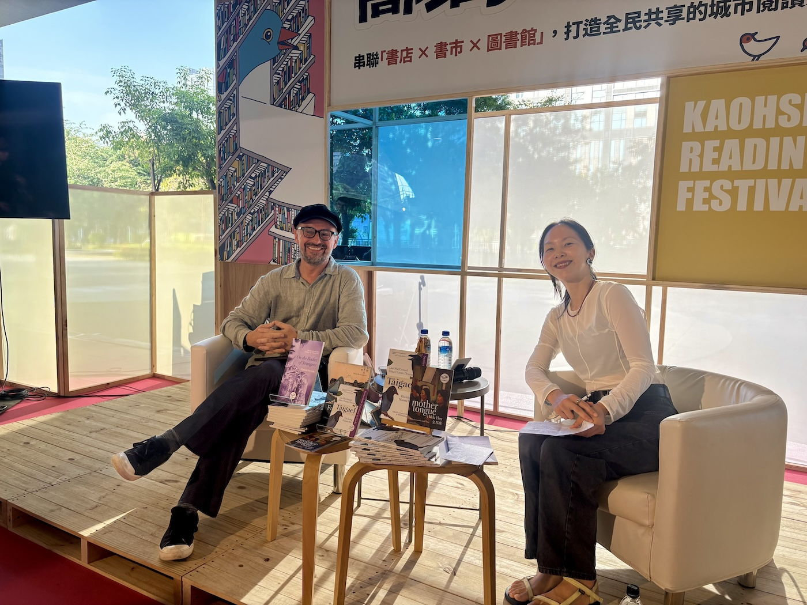

Last weekend, we were in Kaohsiung, in South of Taiwan, at the Kaohsiung Readers Festival, where Will was talking in Mandarin (not Gaelic or Taiwanese!) with Su Shin, the manager of Bookman Books / 書林書店 about *Tâigael*, heritage languages, translation, and writing across and between cultures. The event was a whole lot of fun, and it was great to see copies of *Tâigael* out in the wild — and in the hands of readers!